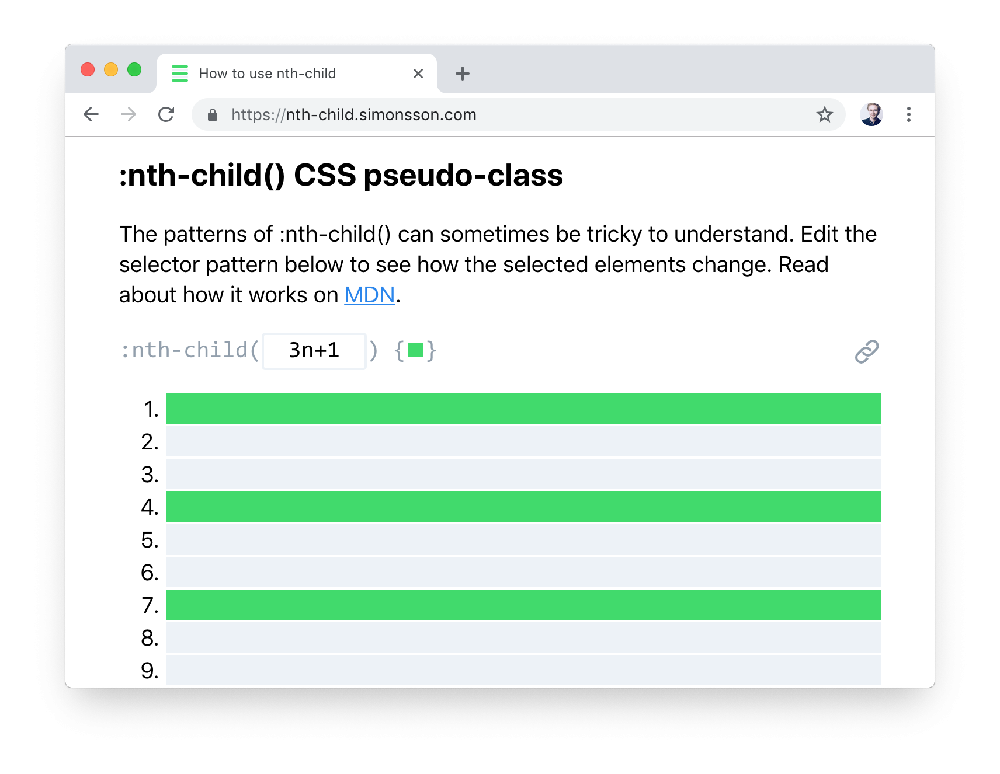

Despite CSS’s relatively simple nature, there are a few things that I just can’t seem to grok. One of these things is the pattern that the nth-child() pseudo selector takes. Things usually deteriorates into a trial-and-error search for the right pattern. So, let's take a step back and talk about what it does and how it works.

By adding :nth-child() to a selector, you're selecting a sequence from a list of elements, according to the pattern. While keyword patterns like `odd` or `even` are easy to predict the result of, something like `3n+1` can be a bit more difficult.

## An example

The way to reason about it is to replace `n` with a sequence of numbers, and nth-child() selects the results.

For the pattern `3n+1`:

| Pattern | n   | Equation       | Selected element |
| :------ | :-- | :------------- | :--------------- |
| `3n+1`  | 0   | 3 × 0 + 1 = 1  | 1                |
| `3n+1`  | 1   | 3 × 1 + 1 = 4  | 4                |
| `3n+1`  | 2   | 3 × 2 + 1 = 7  | 7                |
| `3n+1`  | 3   | 3 × 3 + 1 = 10 | 10               |
| `3n+1`  | 4   | 3 × 4 + 1 = 13 | 13               |

This is all fine in theory, but becomes confusing when you have to type the pattern for “every third element starting with number four” or determine what `4n+3` will select.

## The solution

To quickly and visually get an understanding of how it works, I created a small tool that provides an easier way to reason about it. This helped me, and maybe it will help you too. Give it a try and tell me what you think!

[Try it here](https://nth-child.simonsson.com/)

